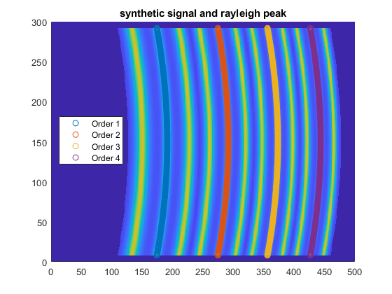

# Brillouin line scan spectral analysis 

## In short
The aim of this library is to provide **GPU acceleration** to the data processing needed in Brillouin microscopy.
The various fits are done on with [the Gpufit library](https://github.com/gpufit/Gpufit), to which custom function were added
(Lorentzian, quadratic and broadened Brillouin lineshape functions). The initial CPU processing was done in Matlab 
by **Carlo Bevilacqua**. He also worked on the physical microscope which provided the data we tested the code on.
The GPU code, the Gpufit wrapper and the rest of the code in this repository was made by **Sebastian Hambura**. 

On a Nvidia GeForce 1050 Ti, a speedup of about 10^3 was measured :
the processing of an image (~300 lines fitted) took ~10ms. 

* For more information about the scientific aspect, see the publication : [link to Carlo's paper]
* For more information about the code, you can look into example.cpp and DLL_wrapper.cpp. A documentation can 
also be created by using doxygen.

## How to install it
The project was developped on Visual Studio 2019, with Cuda 11.5 and Matlab 2019. Other version should work,
but there might be some twinkering to do.

If after downloading the project, you can directly run the Matlab example and get results, congratulation 
you can start processing Brillouin images quickly ! However, it's likely not going to be so easy because of 
some cuda version incompabilities. The safest way to compile this library is to start from the 
Gpufit fork and to create the gpufit.dll on your PC. Then compile this library, and start the test to see if it works
(you'll need to copy gpufit.dll in the same folder as GPUFitting.exe). If it works, create the GPUFitting.dll 
and replace the .dll in Matlab/GPU_Fitting with the ones you just created. You should now be able to run the Matlab example !_

**0 Install and compile gpufit with the new function added. (optional)**

- Either get the source code from the [original Github project](https://github.com/gpufit/Gpufit) and add the functions yourself, 
The source code for the new function can be found in the folder "Gpufit_patch/models". 
This [page](https://gpufit.readthedocs.io/en/latest/customization.html) explains how to add new function to Gpufit.
- Use this [fork](https://github.com/prevedel-lab/Gpufit), already containing the additional functions.
[This](https://gpufit.readthedocs.io/en/latest/installation.html#running-cmake-from-the-command-line)
 page from Gpufit's documentation explains how to compile it on windows with Visual Studio. 
- Alternatively, you can also just use the precompiled gpufit.dll file from the "bin" folder.

**1 Install and compile this library**

Download this code, and open it with Visual Studio. You might have to change the targetted cuda version :
right-click on the solution name > Build dependency > Build customization and select the cuda version you have installed.

Compiling this library as Debug or Release should run an example: it tests 2 custom functions on Gpufit, then creates
a synthetic Brillouin signal, which gets processed by the pipeline and the standalone functions. All the output are in 
the console.

Compile the library as a DLL to run it from Matlab (or another software of your choice). Depending on how you did the 
previous step, you might have to update the header files from Gpufit : we need to have the same function naming convention 
between Gpufit and this wrapper.

**2 Run from Matlab**

To run from Matlab, you need the dll from the patched Gpufit and from this library. You will also need to header files from
this project, so that Matlab knows how to call the function : DLL_struct.h and DLL_wrapper.h.

In Matlab, you can then create the class which will call the function. The code Carlo used is in the Matlab folder, 
together with a matlab script example creating a synthetic signal, fitting it and then displaying a curve and it's 
fitted version. 

## Pipeline vs Standalone functions
	
 There are 2 ways to use this library : either use the pipeline functions or use the standalone function. In the Matlab 
 example, only the pipeline version was used. You'll find an example about how to call the standalone functions in 
 the example.cpp file.

 The pipeline stores as much information as possible inside the GPU, and keeps it between each run. There is less transfer between GPU 
 and CPU necessary between each analysis of an image. This is the fastest option.

 In comparaison, the standalone functions always return the results back to the CPU memory, so there is more time spent 
 on transfering the memory. However, this also allows to see intermediate results, which is usefull for debugging.

## How this library works

1. On the image (or stack of images), determine the position of each order's Rayleigh peak.  

2. Send this information to create the frequency look-up-table. This determines for each pixel in the image
its corresponding freqency. Now given a individual image, it can determine the position of the 3 peaks.  

3. Fuse the different order together, to improve the SNR.  

4. For each peak, starting with the central (Rayleigh) one : extract from the curve the part corresponding to the peak, 
and do a fit with Gpufit on that part.  

5. Retrieve the fitted parameters (and goodnees of fit values). 
6. Once you have analysed all your data, free the memory of the GPU (e.g. close the pipeline if you used it).      

## Remarks

* Make sure that the input image is 16-bit.
* Take care that Matlab start the indexes at 1, while this library starts at 0, so a translation has to be done
with the rayleigh position.
* Depending on the camera setup, but also the conventions (e.g. Matlab vs C++), you might have to translate the input
image to have the orientation expected from the code.
* There is a stripe pattern appearing when the peaks get narrow. We explain that by the algorithm not beeing able
 to discriminate between a high amplitude narrow signal, whose peak is between 2 pixels, and a lower amplitude broader signal. 
This could be solved as we now the theoretical curvature of the signal, but it wasn't implemented for now.
* We sometime faced incompatibilities between the compilled .dll and the computer running the code. This was due to different cuda version on 
the computer. We solved that issue by compiling the gpufit.dll on the computer with the newest cuda version, and keeping that recent version
on the PC.
* If needed, there are quite a lot of optimisation opportunities left in the code. However, we already got the 
performance wanted, so we didn't pursuit them.

## Used code

* GpuFit : Gpufit: An open-source toolkit for GPU-accelerated curve fitting
 Adrian Przybylski, Bj�rn Thiel, Jan Keller-Findeisen, Bernd Stock, and Mark Bates
 Scientific Reports, vol. 7, 15722 (2017); doi: https://doi.org/10.1038/s41598-017-15313-9
* ASA241 : https://people.math.sc.edu/Burkardt/cpp_src/asa241/asa241.html
* David Tschumperlé. The CImg Library. IPOL 2012 Meeting on Image Processing Libraries, Jun 2012,
Cachan, France. 4 pp. hal-00927458 https://cimg.eu/index.html

## Contact

[Prevedel Lab, EMBL](https://www.prevedel.embl.de/)

## Licence

Copyright (C) 2020-2022  Sebastian Hambura

This program is free software: you can redistribute it and/or modify
it under the terms of the GNU General Public License as published by
the Free Software Foundation; either version 3 of the License, or
(at your option) any later version.

This program is distributed in the hope that it will be useful,
but WITHOUT ANY WARRANTY; without even the implied warranty of
MERCHANTABILITY or FITNESS FOR A PARTICULAR PURPOSE.  See the
GNU General Public License for more details.

You should have received a copy of the GNU General Public License
along with this program.  If not, see <https://www.gnu.org/licenses/>.
